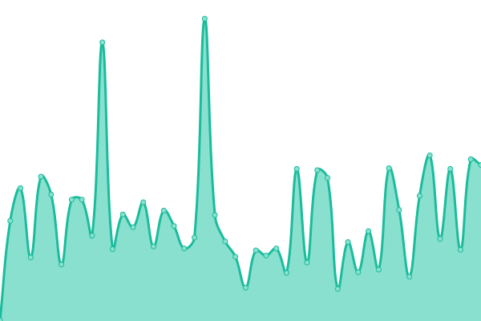
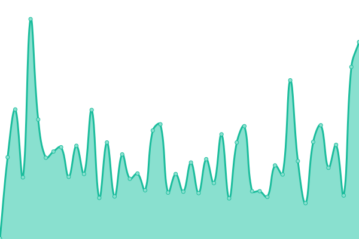

# [📈 Live Status](https://Ciffone-Digital.github.io/lmp-upptime-monitor): <!--live status--> **🟩 All systems operational**

This repository contains the open-source uptime monitor and status page for [Ciffone Digital](https://ciffonedigital.com), powered by [Upptime](https://github.com/upptime/upptime).

With [Upptime](https://upptime.js.org), you can get your own unlimited and free uptime monitor and status page, powered entirely by a GitHub repository. We use [Issues](https://github.com/Ciffone-Digital/upptime-monitor/issues) as incident reports, [Actions](https://github.com/Ciffone-Digital/upptime-monitor/actions) as uptime monitors, and [Pages](https://Ciffone-Digital.github.io/upptime-monitor) for the status page.

<!--start: status pages-->
<!-- This summary is generated by Upptime (https://github.com/upptime/upptime) -->
<!-- Do not edit this manually, your changes will be overwritten -->
<!-- prettier-ignore -->
| URL | Status | History | Response Time | Uptime |
| --- | ------ | ------- | ------------- | ------ |
|  Claims | 🟩 Up | [claims.yml](https://github.com/Ciffone-Digital/lmp-upptime-monitor/commits/HEAD/history/claims.yml) | 

 164ms
     
 | 

<a href="https://Ciffone-Digital.github.io/lmp-upptime-monitor/history/claims">98.04%</a>
    

|  Settlements | 🟩 Up | [settlements.yml](https://github.com/Ciffone-Digital/lmp-upptime-monitor/commits/HEAD/history/settlements.yml) | 

 141ms
     
 | 

<a href="https://Ciffone-Digital.github.io/lmp-upptime-monitor/history/settlements">98.03%</a>
    

<!--end: status pages-->

[**Visit our status website →**](https://Ciffone-Digital.github.io/lmp-upptime-monitor)

## 📄 License

- Powered by: [Upptime](https://github.com/upptime/upptime)
- Code: [MIT](./LICENSE) © [Ciffone Digital](https://ciffonedigital.com)
- Data in the `./history` directory: [Open Database License](https://opendatacommons.org/licenses/odbl/1-0/)
